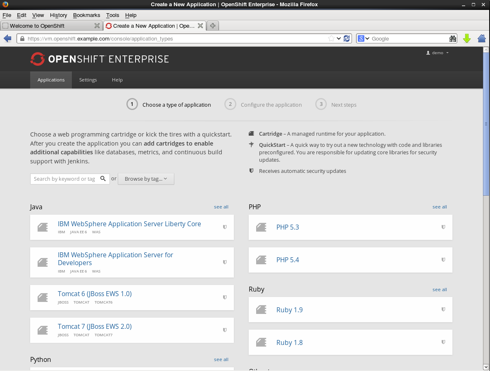

IBM WebSphere Application Server Liberty Core on OpenShift Handbook
======================================================

A. Synopsis
===========

What this is about
------------------
We've created a IBM WebSphere Application Server Liberty Core cartridge in order to demonstrate the power and flexibility of Red Hat's Open Hybrid Cloud strategy. Liberty Core provides a lightweight alternative to the classic WebSphere Application Server ND (cartridge available here: https://github.com/juhoffma/openshift-origin-websphere-cartridge) mainly targeting web applications using JEE web profile.

The cartridge currently supports the following features:

* Provisioning of new IBM WebSphere Application Server Liberty Core instances in seconds (!)
* Full build & Deploy life cycle (as with JBoss EAP cartridge)
* Hot Deployment
* Auto Scaling with web traffic
* Jenkins Integration
* Integration into JBoss Developer Studio

The source code can be found here: https://github.com/juhoffma/openshift-origin-liberty-cartridge

Screenshots
------------------



B. Installation
===============

1. Setup OSE Environment
------------------------
You have the following deployment options for this cartridge:

* OpenShift Origin developer image (http://openshift.github.io/documentation/oo_deployment_guide_vm.html)
* OpenShift Enterprise developer image (https://rhn.redhat.com/rhn/software/channel/downloads/Download.do?cid=21355)
* Standalone installation of Red Hat OpenShift Enterprise.

## 2. Cartridge Installation

This cartridge does not actually ship the Liberty Profile binaries. These
have to be installed manually before this cartridge actually works. The Binaries can
be installed in 2 different ways:

* OPTION 1 - Install the Liberty Core underneath the versions directory
* OPTION 2 - Install Liberty Core outside of the cartridge context

The following sections describe the 2 different methods.

### Prepare the installation
Download the required IBM WebSphere Application Server Liberty Core Installer from the IBM developer site  (https://developer.ibm.com/wasdev/downloads/liberty-profile-using-non-eclipse-environments/):

    node# cd /opt
    node# wget https://public.dhe.ibm.com/ibmdl/export/pub/software/websphere/wasdev/downloads/wlp/8.5.5.4/wlp-developers-runtime-8.5.5.4.jar

Clone the cartridge repository:

    node# git clone https://github.com/juhoffma/openshift-origin-liberty-cartridge.git

    Initialized empty Git repository in /opt/openshift-origin-liberty-cartridge/.git/
    remote: Counting objects: 139, done.
    remote: Compressing objects: 100% (103/103), done.
    Receiving objects: 100% (139/139), 898.18 KiB | 1.33 MiB/s, done.
    remote: Total 139 (delta 46), reused 106 (delta 15), pack-reused 0
    Resolving deltas: 100% (46/46), done.

### OPTION 1 - Install the Liberty Core underneath the versions directory

    node# java -jar /opt/wlp-developers-runtime-8.5.5.4.jar --acceptLicense /opt/openshift-origin-liberty-cartridge/versions/8.5.5.4

    Before you can use, extract, or install IBM WebSphere Application
    Server for Developers V8.5.5, you must accept the terms of
    International License Agreement for Non-Warranted Programs and
    additional license information. Please read the following license
    agreements carefully.


    The --acceptLicense argument was found. This indicates that you have
    accepted the terms of the license agreement.


    Extracting files to /opt/openshift-origin-liberty-cartridge/versions/8.5.5.4/wlp
    Successfully extracted all product files.

### OPTION 2 - Install Liberty Core outside of the cartridge context

#### Binary installation
You can also install IBM WebSphere Application Server Liberty Core outside of the cartridge and
define the location using a node level variable like you can do with the full
[WebSphere](https://github.com/juhoffma/openshift-origin-websphere-cartridge) cartridge.

To make this work all you have to do is to create the file
`/etc/openshift/env/OPENSHIFT_LIBERTY_INSTALL_DIR` and put the installation location into
it. See the [Official Documentation](https://access.redhat.com/documentation/en-US/OpenShift_Enterprise/2/html-single/Administration_Guide/index.html#Creating_Environment_Variables_on_Node_Hosts) for an example on how to configure node level variables.

#### Customize SELinux Configuration
Since IBM WebSphere Application Server Liberty Core is installed outside of the gear's sandbox, you need to customize SELinux permission settings in a way that the installation directory "/opt/IBM/<LIBERTY_CORE_WLP>" can be accessed with according permissions.

As a workaround and/or for testing purposes you could also temporarily disable SELinux policy enforcement:
```
setenforce 0
```

### Install and activate the cartridge

    node# oo-admin-cartridge --action install -s /opt/openshift-origin-liberty-cartridge --mco


    1 / 1
    vm.openshift.example.com
       output: install succeeded for /opt/openshift-origin-liberty-cartridge
    Finished processing 1 / 1 hosts in 3174.10 ms

    broker# oo-admin-ctl-cartridge -c import-node --activate --obsolete --force
    Importing cartridges from node 'vm.openshift.example.com'.
    Updating 26 cartridges ...
    54f62e57e659c5cd31000001 # U mysql-5.5 (active)
    54f62e57e659c5cd31000002 # U mysql-5.1 (active)
    54f62e57e659c5cd31000003 # U jenkins-1 (active)
    54f62e57e659c5cd31000004 # U nodejs-0.10 (active)
    54f62e57e659c5cd31000005 # U haproxy-1.4 (active)
    54f62e57e659c5cd31000006 # U jbosseap-6 (active)
    54f62e57e659c5cd31000007 # U jbossews-2.0 (active)
    54f62e57e659c5cd31000008 # U jbossews-1.0 (active)
    54f62e57e659c5cd31000009 # U php-5.4 (active)
    54f62e57e659c5cd3100000a # U php-5.3 (active)
    54f62e57e659c5cd3100000b # U mongodb-2.4 (active)
    54f62e57e659c5cd3100000c # U postgresql-9.2 (active)
    54f62e57e659c5cd3100000d # U postgresql-8.4 (active)
    54f62e57e659c5cd3100000e # U python-3.3 (active)
    54f62e57e659c5cd3100000f # U python-2.7 (active)
    54f62e57e659c5cd31000010 # U python-2.6 (active)
    54f62e57e659c5cd31000011 # U perl-5.10 (active)
    54f62e57e659c5cd31000012 # U diy-0.1 (active)
    54f62e57e659c5cd31000013 # U jenkins-client-1 (active)
    54f62e57e659c5cd31000014 # U ruby-1.8 (active)
    54f62e57e659c5cd31000015 # U ruby-1.9 (active)
    54f62e57e659c5cd31000016 # U ruby-2.0 (active)
    54f62e57e659c5cd31000017 # U amq-6.1.1 (active)
    54f62e57e659c5cd31000018 # U cron-1.4 (active)
    54f62e57e659c5cd31000019 # U fuse-6.1.1 (active)
    54f62e57e659c5cd3100001a # A hoffmann-liberty-8.5.5.4 (active)

Make sure you see the line reporting the cartridge **54f62e57e659c5cd3100001a # A hoffmann-liberty-8.5.5.4 (active)**

    broker# oo-admin-broker-cache --clear; oo-admin-console-cache --clear

C. Reference Information
========================

WebSphere specific
------------------
* Getting started with Liberty for Developers -  http://www.redbooks.ibm.com/abstracts/sg248076.html?Open
* Supported Software & Hardware -  http://www-01.ibm.com/support/docview.wss?uid=swg27038218
* IBM Information Center -  http://www-01.ibm.com/support/knowledgecenter/SSD28V_8.5.5/com.ibm.websphere.wlp.core.doc/ae/cwlp_core_welcome.html
* Command port needs to be disabled - http://www-01.ibm.com/support/docview.wss?uid=swg1PM89272

OpenShift specific
------------------
* IBM WebSphere Application Server ND Cartridge - https://github.com/juhoffma/openshift-origin-websphere-cartridge
